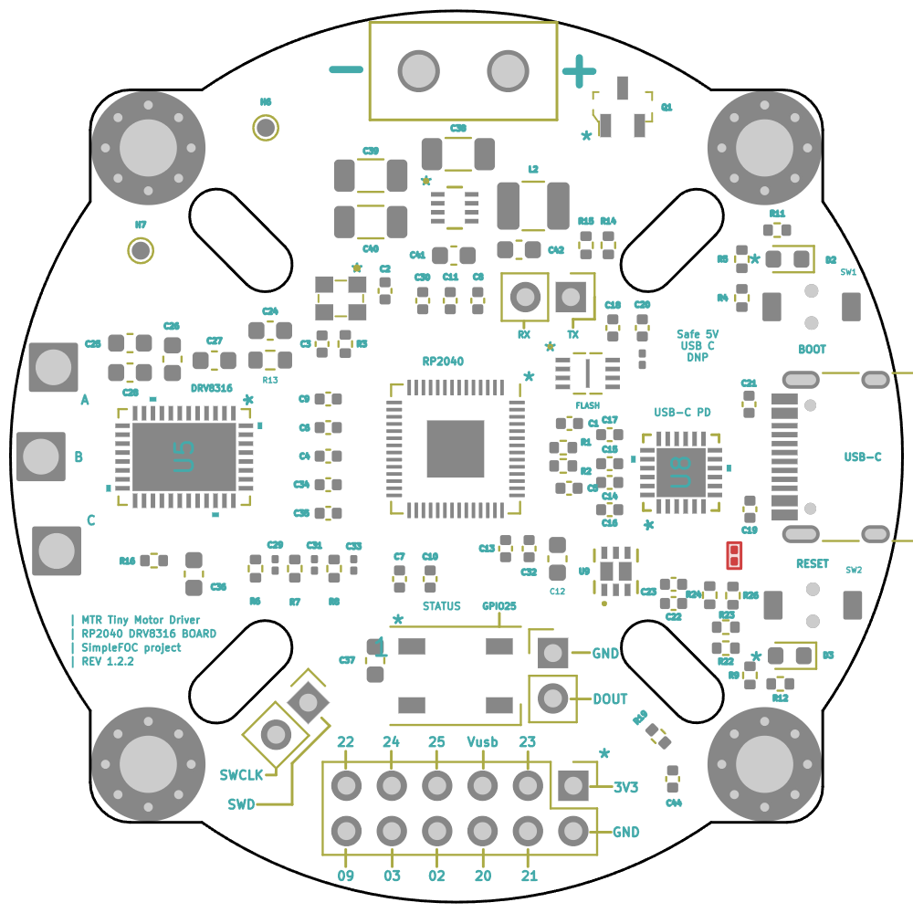
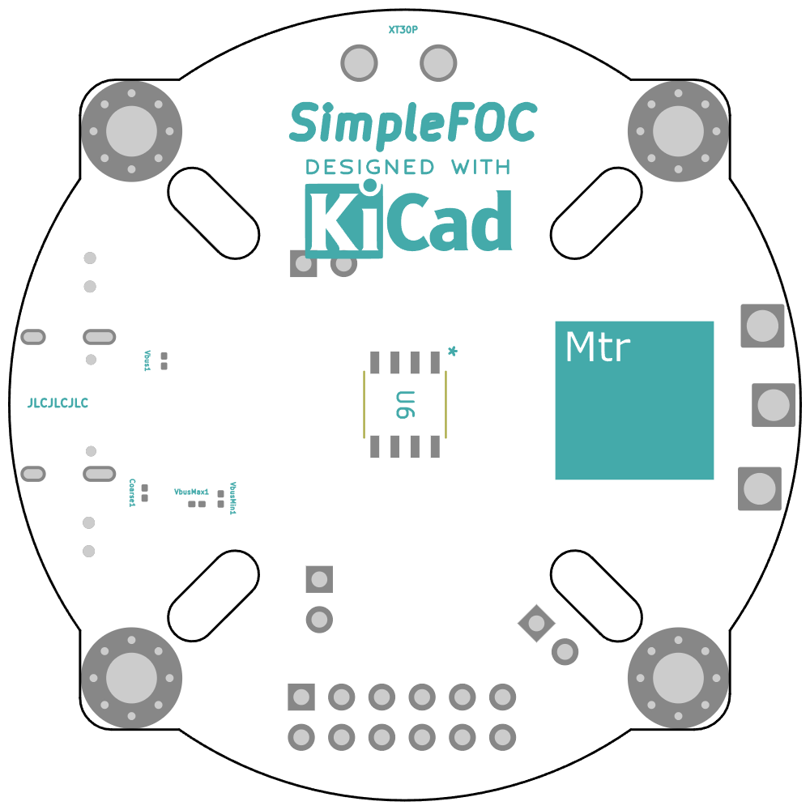

# MTR_Tiny_MD

 

    <iframe width="560" height="315" src="https://www.youtube.com/embed/xt2y6jAOXSE" frameborder="0" allow="accelerometer; autoplay; clipboard-write; encrypted-media; gyroscope; picture-in-picture" allowfullscreen>
    </iframe>

# Changelog

This changelog provides a summary of the updates and changes made to the Motor Driver - MTR Tiny Motor Driver.

## Revision History:

- Rev: 1.0.3 Date: 20/03/2023
    - Update: Stepper motor controller board
    - Update: Brushless motor controller board

- Rev: 1.1.0 Date: 10/05/2023
    - Update: Overview Board w/ BLDC + Support

- Rev: 1.2.0 Date: 14/09/2023
    - Update: Power Delivery controller
    - Update: Correct SPI wrong connection
    - Update: Update net design (power net)
    - Update: Rx & Tx pinout can be used for CAN

- Rev: 1.2.2 Date: 20/09/2023
    - Update: Add low pass filter for Reset button

# Overview

    
     
    <em>Front</em>

    
     
    <em>Back</em>

<iframe
    width="640"
    height="480"
    src="https://www.youtube.com/embed/xt2y6jAOXSE"
    frameborder="0"
    allow="autoplay; encrypted-media"
    allowfullscreen
>
</iframe>

**Note:** Please refer to the [schematic](Docs/MTR_Tiny_MD.pdf) for detailed information about the MTR Tiny Motor Driver.